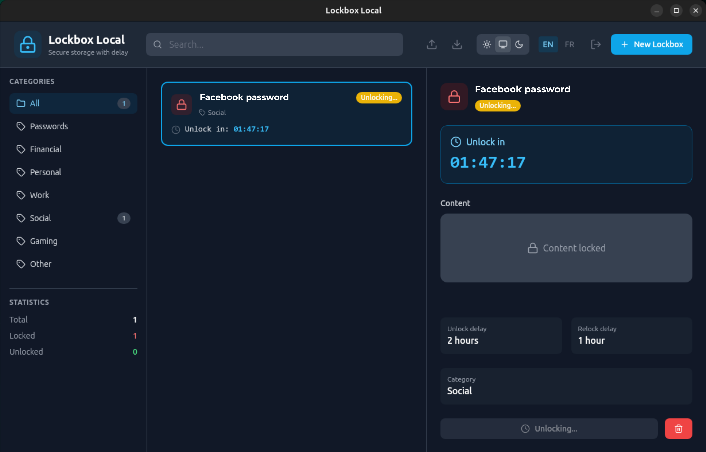

# Lockbox Local v2.0

> [🇫🇷 Version française](README.fr.md) | [🇬🇧 English version](README.md)

A secure desktop application for storing sensitive information with access delay, built with **React 19**, **TypeScript** and **Tauri 2.0**.


[](LICENSE)

[](https://github.com/bleriotnoguia/lockbox-local/releases/latest)

<p align="center">
  
</p>

## Download

Download the latest version for your platform:

| Platform | Download |
|----------|----------|
| Windows (.msi) | [Download](https://github.com/bleriotnoguia/lockbox-local/releases/latest) |
| Linux (.deb) | [Download](https://github.com/bleriotnoguia/lockbox-local/releases/latest) |
| Linux (.AppImage) | [Download](https://github.com/bleriotnoguia/lockbox-local/releases/latest) |
| macOS (.dmg) | [Download](https://github.com/bleriotnoguia/lockbox-local/releases/latest) |

> All releases are available on the [Releases page](https://github.com/bleriotnoguia/lockbox-local/releases).

## Install

### Linux (Ubuntu/Debian) — .deb

1. Download the `.deb` file from the [Releases page](https://github.com/bleriotnoguia/lockbox-local/releases/latest)
2. Install with:

```bash
sudo dpkg -i Lockbox-Local_*.deb
```

If dependencies are missing:

```bash
sudo apt-get install -f
```

### Windows — .msi

1. Download the `.msi` file from the [Releases page](https://github.com/bleriotnoguia/lockbox-local/releases/latest)
2. Double-click the file and follow the installation wizard
3. Launch **Lockbox Local** from the Start menu

### macOS — .dmg

1. Download the `.dmg` file from the [Releases page](https://github.com/bleriotnoguia/lockbox-local/releases/latest)
2. Open the `.dmg` file
3. Drag **Lockbox Local** to the **Applications** folder
4. Launch from Applications or Spotlight

### Linux — AppImage

1. Download the `.AppImage` file from the [Releases page](https://github.com/bleriotnoguia/lockbox-local/releases/latest)
2. Make it executable:

```bash
chmod +x Lockbox-Local_*.AppImage
```

3. Run it:

```bash
./Lockbox-Local_*.AppImage
```

No installation required — the AppImage runs as a portable application.

## Uninstall

### Linux (Ubuntu/Debian) — .deb

```bash
sudo apt remove lockbox-local
```

To also remove config and data:

```bash
sudo apt remove lockbox-local
rm -rf ~/.local/share/com.lockbox.local
rm -rf ~/.config/com.lockbox.local
```

### Windows — .msi

1. Open **Settings** → **Apps** → **Installed apps**
2. Search for **Lockbox Local**
3. Click the three dots → **Uninstall**

Or via PowerShell:

```powershell
Get-Package -Name "Lockbox Local" | Uninstall-Package
```

### macOS — .dmg

1. Open **Finder** → **Applications**
2. Drag **Lockbox Local** to the Trash
3. Empty the Trash

### Linux — AppImage

If you ran the AppImage directly (no install step):

1. Delete the `.AppImage` file
2. Optionally remove config and data:

```bash
rm -rf ~/.local/share/com.lockbox.local
rm -rf ~/.config/com.lockbox.local
```

## Background & Motivation

Lockbox Local is inspired by [Pluckeye Lockbox](https://lockbox.pluckeye.net/help), a web application that lets you store information in "boxes" which can only be accessed after a delay period. This is useful if you need to hide a password from yourself, for help with **self-control**.

Pluckeye Lockbox has been around for years, but it's a free service run by a single person. As the author warns:

> *"[Pluckeye Lockbox boxes] threaten to destruct mainly so that users do not assume the service will be around forever. You should not assume your data will be kept longer than 1 year, because the service is 100% free and run by one person."* — [(Source)](https://www.reddit.com/r/pluckeye/comments/mvyvmw/lockbox_i_typed_never_into_the_self_destruct_date/)

If you stored a critical password in Pluckeye Lockbox and the server crashed with all data lost, you'd be permanently locked out. **Lockbox Local solves this** by keeping everything on your own machine — no cloud dependency, no risk of service shutdown, and **boxes never self-destruct**.

### What changed from [v1 (Java)](https://github.com/japierreSWE/Lockbox_Local)?

The original Lockbox Local was built with Java and SQLite. This **v2** is a complete rewrite using modern technologies (Tauri 2.0 + React 19 + Rust), bringing AES-256-GCM encryption, a master password, categories, search, theming, and a much smaller footprint (see [comparison table](#comparison-with-v1-java) below).

## Features

- **Secure storage** - End-to-end AES-256-GCM encryption
- **Access delay** - Configurable waiting time before accessing content
- **Auto re-lock** - Lockboxes automatically re-lock after a defined period
- **Master password** - Global application protection
- **Categories** - Organize your lockboxes by category
- **Import/Export** - Backup and restore in JSON format
- **Dark/Light theme** - Adaptive interface according to your preferences
- **Cross-platform** - Works on Windows, macOS and Linux

## Prerequisites

### For development

- [Node.js](https://nodejs.org/) (v20+)
- [Rust](https://rustup.rs/) (stable 1.77+)
- [Tauri CLI 2.0](https://v2.tauri.app/)

### Installing prerequisites on Ubuntu

```bash
# Node.js (via nvm)
curl -o- https://raw.githubusercontent.com/nvm-sh/nvm/v0.39.0/install.sh | bash
source ~/.bashrc
nvm install 18
nvm use 18

# Rust
curl --proto '=https' --tlsv1.2 -sSf https://sh.rustup.rs | sh
source ~/.cargo/env

# System dependencies for Tauri
sudo apt update
sudo apt install -y libwebkit2gtk-4.1-dev \
    build-essential \
    curl \
    wget \
    libssl-dev \
    libgtk-3-dev \
    libayatana-appindicator3-dev \
    librsvg2-dev
```

## Installation

```bash
# Clone the project (if needed)
cd new-lockbox-local

# Install npm dependencies
npm install

# Run in development mode
npm run tauri:dev

# Build for production
npm run tauri:build
```

## Project Structure

```
new-lockbox-local/
├── src/                          # Frontend React/TypeScript
│   ├── components/               # React components
│   │   ├── ui/                   # Reusable UI components
│   │   ├── LockboxCard.tsx       # Lockbox card
│   │   ├── LockboxList.tsx       # Lockbox list
│   │   ├── LockboxDetail.tsx     # Lockbox detail
│   │   ├── CreateLockboxModal.tsx# Creation modal
│   │   ├── Header.tsx            # Header
│   │   ├── Sidebar.tsx           # Sidebar
│   │   └── LoginScreen.tsx       # Login screen
│   ├── hooks/                    # Custom hooks
│   │   ├── useCountdown.ts       # Countdown timer
│   │   ├── useLockboxStatus.ts   # Lockbox status
│   │   └── useExportImport.ts    # Import/Export
│   ├── store/                    # Global state (Zustand)
│   │   ├── lockboxStore.ts       # Lockbox store
│   │   ├── authStore.ts          # Authentication store
│   │   └── themeStore.ts         # Theme store
│   ├── types/                    # TypeScript types
│   ├── styles/                   # CSS/Tailwind
│   ├── App.tsx                   # Main component
│   └── main.tsx                  # Entry point
│
├── src-tauri/                    # Backend Rust/Tauri
│   ├── src/
│   │   ├── main.rs               # Tauri entry point
│   │   ├── db.rs                 # SQLite operations
│   │   ├── crypto.rs             # AES encryption
│   │   └── commands.rs           # Tauri commands
│   ├── Cargo.toml                # Rust dependencies
│   └── tauri.conf.json           # Tauri configuration
│
├── package.json                  # npm dependencies
├── vite.config.ts                # Vite configuration
├── tailwind.config.js            # Tailwind configuration
└── tsconfig.json                 # TypeScript configuration
```

## Usage

### First launch

1. On first launch, create a **master password**
2. This password encrypts all your data
3. **Important**: This password cannot be recovered!

### Create a Lockbox

1. Click on "New Lockbox"
2. Enter a name and the content to protect
3. Configure the unlock delay (waiting time)
4. Configure the re-lock delay (access duration)
5. Optional: Choose a category

### Unlock a Lockbox

1. Select the lockbox
2. Click on "Unlock"
3. Wait for the countdown to finish
4. Content will be visible for the configured duration

### Import/Export

- **Export**: Click on the download icon in the header
- **Import**: Click on the upload icon and select a `.json` file

## Security

### Encryption

- **Algorithm**: AES-256-GCM
- **Key derivation**: PBKDF2 with 100,000 iterations
- **Salt**: Randomly generated for each content

### Storage

- Local SQLite database
- No data sent over the Internet
- All data remains on your machine

## Development

### Available scripts

```bash
# Development
npm run dev          # Runs Vite (frontend only)
npm run tauri:dev    # Runs Tauri + Vite

# Build
npm run build        # Builds the frontend
npm run tauri:build  # Builds the complete application

# Lint
npm run lint         # Checks TypeScript code
```

### Tests

```bash
# Rust tests
cd src-tauri
cargo test
```

## Creating Installation Packages

### .deb Package (Ubuntu/Debian)

To create a `.deb` package on Ubuntu, Tauri automatically generates the package during build:

```bash
# Ensure all dependencies are installed
sudo apt update
sudo apt install -y libwebkit2gtk-4.1-dev \
    build-essential \
    curl \
    wget \
    libssl-dev \
    libgtk-3-dev \
    libayatana-appindicator3-dev \
    librsvg2-dev \
    patchelf

# Install project dependencies
npm install

# Build the application (automatically generates .deb)
npm run tauri:build
```

The `.deb` package will be generated in:
```
src-tauri/target/release/bundle/deb/lockbox-local_2.0.0_amd64.deb
```

**Installing the .deb package:**
```bash
sudo dpkg -i src-tauri/target/release/bundle/deb/lockbox-local_2.0.0_amd64.deb

# If dependencies are missing, install with:
sudo apt-get install -f
```

### .exe Package (Windows)

#### Option 1: Build on Windows (Recommended)

On a Windows machine with prerequisites installed:

```bash
# Install Windows prerequisites
# - Node.js (v20+)
# - Rust (via rustup)
# - Microsoft Visual C++ Build Tools

# Install dependencies
npm install

# Build the application
npm run tauri:build
```

The `.exe` file will be generated in:
```
src-tauri/target/release/lockbox-local.exe
```

An MSI installer will also be created in:
```
src-tauri/target/release/bundle/msi/lockbox-local_2.0.0_x64_en-US.msi
```

#### Option 2: Cross-compilation from Linux (Advanced)

The project uses GitHub Actions to build Windows, Linux, and macOS and to create releases on tag push. See [`.github/workflows/build.yml`](.github/workflows/build.yml) for the workflow.

### Advanced Package Configuration

To customize package metadata, edit [`src-tauri/tauri.conf.json`](src-tauri/tauri.conf.json) (see the `bundle` section, and optionally `bundle.linux.deb` or `bundle.windows`).

> **Note**: By default, Tauri automatically detects the required system dependencies. Only specify the `depends` field if you need to add extra dependencies.

### npm Scripts for Easier Building

You can add these scripts to `package.json`:

```json
{
  "scripts": {
    "build:linux": "tauri build --target x86_64-unknown-linux-gnu",
    "build:windows": "tauri build --target x86_64-pc-windows-msvc",
    "build:all": "npm run build:linux && npm run build:windows"
  }
}
```

## Comparison with [v1 (Java)](https://github.com/japierreSWE/Lockbox_Local)

| Feature | v1 (Java) | v2 (Tauri) |
|---------|-----------|------------|
| Bundle size | ~100 MB | ~15 MB |
| RAM | ~150 MB | ~50 MB |
| Encryption | No | AES-256-GCM |
| Master password | No | Yes |
| Categories | No | Yes |
| Search | No | Yes |
| Dark theme | No | Yes |
| Export format | .lbf (text) | .json |

## License

This project is licensed under the MIT License - See the [LICENSE](LICENSE) file for details.

## Contributing

Contributions are welcome! Feel free to open an issue or a pull request.
